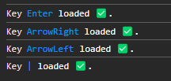

<h1 align='center'>
  UseKeyBoard React
</h1>

<p align='center'>
    UseKeyBoard is a React library that executes code depending on the key pressed.
</p>

### Usage

#### NPM

```bash
npm install usekeyboard-react
```

#### YARN

```bash
yarn add usekeyboard-react
```

```jsx
import { useState } from "react";
import { useKeyBoard } from "usekeyboard-react";
import "./App.css";

export const HomePage = (): JSX.Element => {
  const [count, setCount] = useState < number > 0;

  // Initializes the hook on the current page, configuring the keys.
  useKeyBoard({
    config: {
      keys: [
        {
          key: "Enter",
          fn: () => console.log("Hi Enter"),
        },
        {
          key: "ArrowRight|ArrowLeft",
          fn: () => console.log("Hi Arrows Right and Left"),
        },
        {
          key: "a|b",
          fn: (e) => {
            if (e.key === "a") console.log("i am A");
            if (e.key === "b") console.log("i am B");
          },
        },
      ],
      dependencies: [],
      debug: true,
    },
  });

  return (
    <main>
      <h1>Home Page</h1>
      <p>{count}</p>
      <button onClick={() => setCount((prev) => prev + 1)}></button>
    </main>
  );
};
```

Ideally, the hook should be used in the parent component of the current page being rendered. That is to say, we will call it only once based on the page we are rendering. In this case in HomePage as an example.

### Portfolio Link

`https://www.diegolibonati.com.ar/#/project/UseKeyBoard`

### Npm PACKAGE Link

`https://www.npmjs.com/package/usekeyboard-react`

### Props

| Prop           | Description                                                                                                                                                                                                                                                                                                                                | Type                                                | Default |
| -------------- | ------------------------------------------------------------------------------------------------------------------------------------------------------------------------------------------------------------------------------------------------------------------------------------------------------------------------------------------ | --------------------------------------------------- | ------- |
| `keys`         | `keys` refers to the set of key identifiers to be pressed together with the function to be executed.                                                                                                                                                                                                                                       | `{ key: string; fn: (e: KeyboardEvent) => void }[]` | -       |
| `dependencies` | The `dependencies` dependency is used to indicate to React when it should recreate the `onKeyPress` function. If any value in `dependencies` changes between renders, React will recreate the `onKeyPress` function with the new values. If `dependencies` doesn't change, React will reuse the previously memoized `onKeyPress` function. | `React.DependencyList`                              | -       |
| `debug`        | Set to `true` or `false` to debug useKeyBoard Hook                                                                                                                                                                                                                                                                                         | `boolean`                                           | -       |

Example if debug prop is in true:



## Multiple Keys with the same Function

If you want to declare 2 or more keys that have the same function to be executed you can use the string “|”.

In this case the keys 0, 1, 2, 3, 3, 4, 5, 6, 7, 8 and 9 will execute the command in console: Hi, im a number.

```jsx
import { useKeyBoard } from "usekeyboard-react";
import "./App.css";

export const HomePage = (): JSX.Element => {
  useKeyBoard({
    config: {
      keys: [
        {
          key: "0|1|2|3|4|5|6|7|8|9",
          fn: () => console.log("Hi, im a number"),
        },
      ],
      dependencies: [],
      debug: true,
    },
  });

  return (
    <main>
      <h1>Home Page</h1>
    </main>
  );
};
```

## Using the keyboard event (KeyboardEvent)

We can also pass inside our execution function the `keydown` event.

`e` refers to Javascript's KeyboardEvent.

```jsx
import { useKeyBoard } from "usekeyboard-react";
import "./App.css";

export const HomePage = (): JSX.Element => {
  // Initializes the hook on the current page, configuring the keys.
  useKeyBoard({
    config: {
      keys: [
        {
          key: "a|b",
          fn: (e) => {
            if (e.key === "a") console.log("i am A");
            if (e.key === "b") console.log("i am B");
          },
        },
      ],
      dependencies: [],
      debug: true,
    },
  });

  return (
    <main>
      <h1>Home Page</h1>
    </main>
  );
};
```

### Another Example

Here we are creating actions for when the up, down, right, left, and enter keys on the keyboard are pressed. For each assigned key, a function to execute is assigned for that specific key. Additionally, in the dependencies array, the dependencies for channels and focusedIndex are passed so that the functions inside the keys are updated based on the current state of both dependencies. Finally, debug is set to True so that development messages appear in the console to see information about our hook.

```jsx
import { useState } from "react";
import { useKeyBoard } from "usekeyboard-react";

const [focusedIndex, setFocusedIndex] = useState<number>(0);
useKeyBoard({
    config: {
        keys: [
        {
            key: "ArrowRight",
            fn: () => {
                setFocusedIndex((prevIndex) =>
                    prevIndex === channels?.length! - 1 ? 0 : prevIndex + 1
                );
                return;
            },
        },
        {
            key: "ArrowLeft",
            fn: () => {
                setFocusedIndex((prevIndex) =>
                    prevIndex === 0 ? channels?.length! - 1 : prevIndex - 1
                );
                return;
            },
        },

        {
            key: "ArrowUp",
            fn: () => {
                setFocusedIndex((prevIndex) =>
                    prevIndex === 0 || prevIndex === 1 || prevIndex === 2
                    ? channels?.length! - 1
                    : prevIndex - 1
                );
                return;
            },
        },
        {
            key: "ArrowDown",
            fn: () => {
                setFocusedIndex((prevIndex) =>
                    prevIndex === channels?.length! - 1 ||
                    prevIndex === channels?.length! - 2 ||
                    prevIndex === channels?.length! - 3
                    ? 0
                    : prevIndex + 1
                );
            },
        },
        {
            key: "Enter",
            fn: () => {
                handleSetChannel(channels![focusedIndex]);
                handleNavigateTo("/tv");
                return;
            },
        },
        ],
        dependencies: [focusedIndex, channels],
        debug: true,
    },
});
```

## Best practices or Other uses

### You are free to create new best practices, choose your own style, or put your own touch on it. You are free.

For better usage, we can create a variable that contains our array of keys, saving space in the code. For example:

```jsx
const KEYS = [
  {
    key: "ArrowDown",
    fn: () => console.log("ArrowDown Pressed"),
  },
  {
    key: "Enter",
    fn: () => console.log("Enter Pressed"),
  },
];

useKeyBoard({
  config: {
    keys: KEYS,
    dependencies: [],
    debug: true,
  },
});
```

Another example:

```jsx
const handlePressArrowDown = (): void => {
  console.log("ArrowDown Pressed");
};

const KEYS = [
  {
    key: "ArrowDown",
    fn: () => handlePressArrowDown(),
  },
  {
    key: "Enter",
    fn: () => console.log("Enter Pressed"),
  },
];

useKeyBoard({
  config: {
    keys: KEYS,
    dependencies: [],
    debug: true,
  },
});
```

## Develop

If you want to develop or collaborate with this project, please follow point by point:

1. Clone the project with `git clone https://github.com/DiegoLibonati/UseKeyBoard.git`
2. Join to the correct path of the clone
3. Execute: `yarn install` or `npm install`
4. Execute the command: `yarn storybook`
5. Enjoy and develop

## Testing

1. Join to the correct path of the clone
2. Execute: `yarn test` or `npm test`

